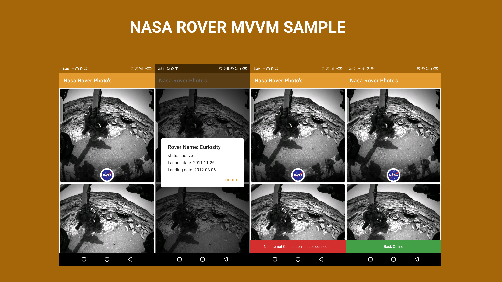

# Nasa-Rover-MVVM-Sample

## About
 A simple project showcasing the usage of MVVM architecture, together with kodein for Dependency injection, to create an android application that fetches data from the Nasa Rover Api.

 - [Playstore](https://play.google.com/store/apps/details?id=com.maku.easydata) - Coming Soon.
 - BASE URL [Nasa Rover Api](https://api.nasa.gov/mars-photos/api/v1/rovers/curiosity/photos?sol=1000&api_key=<REPLACE_WITH_YOUR_API_KEY>)

## Built With 🛠
- [Kotlin](https://kotlinlang.org/) - First class and official programming language for Android development.
- [ViewBinding](https://developer.android.com/topic/libraries/view-binding) - Generates a binding class for each XML layout file present in that module and allows you to more easily write code that interacts with views.
- [Retrofit](https://square.github.io/retrofit/) - A type-safe HTTP client for Android and Java.
- [Kodein DI on Android](https://kodein.org/Kodein-DI/?5.0/android) - Used for dependecy injection in android
- [Room Persistance](https://developer.android.com/topic/libraries/architecture/room) - The Room persistence library provides an abstraction layer over SQLite to allow for more robust database access while harnessing the full power of SQLite.
- [Glide](https://github.com/bumptech/glide) - An image loading and caching library for Android focused on smooth scrolling
- [Kotlin coroutines on Android](https://developer.android.com/kotlin/coroutines) - coroutines help to manage long-running tasks that might otherwise block the main thread and cause your app to become unresponsive.
- [Github actions](https://github.com/features/actions) - Automate your workflow
from idea to production

## How to use this project
- Clone the project
- Add your own API KEY
- Build and Run the project.

## Contact
If you need any help, you can connect with me at [MAZAKPE](makpalyy@gmail.com).

## Credits
This project was made possible by knowledge got from [Carlos Daniel](https://proandroiddev.com/implementing-an-android-app-with-jetpack-mvvm-ui-state-manage-and-some-other-interesting-stuff-e965b420f5a8)

Visit:- [maku](https://www.linkedin.com/in/maku-mazakpe-700a3a165/)
